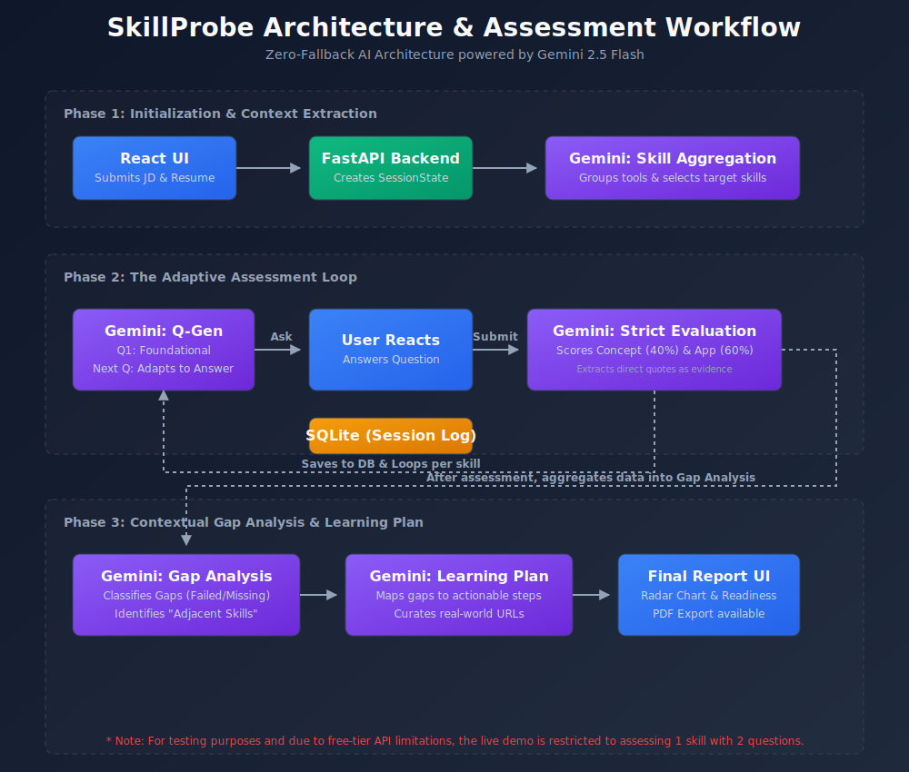

# SkillProbe Architecture

SkillProbe is designed as a modern, decoupled web application. It relies entirely on **Gemini 2.5 Flash** for its reasoning capabilities, orchestrated by a robust **FastAPI** backend, and presented via a **React (Vite)** frontend.

## Core Philosophy: Zero-Fallback AI
A critical design decision in SkillProbe is the **strict reliance on LLM reasoning with no hardcoded fallbacks**.
If Gemini fails to parse a resume or evaluate an answer (e.g., due to API rate limits or safety filters), the system does **not** fall back to fake, pre-programmed data. Instead, errors are caught gracefully, logged to a session trace, and bubbled up to the UI as clear, actionable `502 Bad Gateway` errors. This ensures the integrity of the assessment.

## Backend Stack (FastAPI / Python)

The backend operates as an asynchronous orchestrator, managing state and communicating with Gemini.

1. **State Management (`app/models/session.py`)**
   - We use an in-memory SQLite store with Pydantic models to track the exact state of an interview.
   - The `SessionState` records the initial JD, the extracted skills, every question asked, the candidate's answer, and the AI's step-by-step evaluation.

2. **LLM Orchestration (`app/services/gemini_service.py`)**
   - All AI interactions flow through a centralized `GeminiService`.
   - **Crucial Implementation Detail:** The Google GenAI SDK's `generate_content` call is synchronous. To prevent blocking the FastAPI event loop and crashing the server under load, this call is wrapped in an `asyncio.to_thread()` executor.
   - Responses are strictly validated against Pydantic schemas. If Gemini hallucinates schema fields, the robust `_normalize_` functions in our models cast strings to floats and infer boolean logic before failing.

3. **Service Layer Separation**
   - The logic is decoupled into specific services (`assessment_service.py`, `gap_service.py`, `report_service.py`) which inject exact context into predefined prompt templates.

## Frontend Stack (React / Vite)

The frontend is a single-page application built without heavy CSS frameworks, relying on custom CSS for a premium, glassmorphism aesthetic.

- **Component Hierarchy:** The `App.tsx` handles the main application loop (Input -> Assessment -> Report).
- **Loading Overlay:** Because LLM calls can take 5-10 seconds, a dynamic `LoadingOverlay` tracks the exact stage of the pipeline (e.g., "Analysing gaps...") and cycles through relevant interview prep tips to keep the user engaged.
- **Data Visualization:** The report utilizes custom SVG components (`SkillRadar.tsx` and `ReadinessGauge.tsx`) instead of heavy charting libraries to visualize the complex multi-dimensional evaluation data returned by Gemini.
